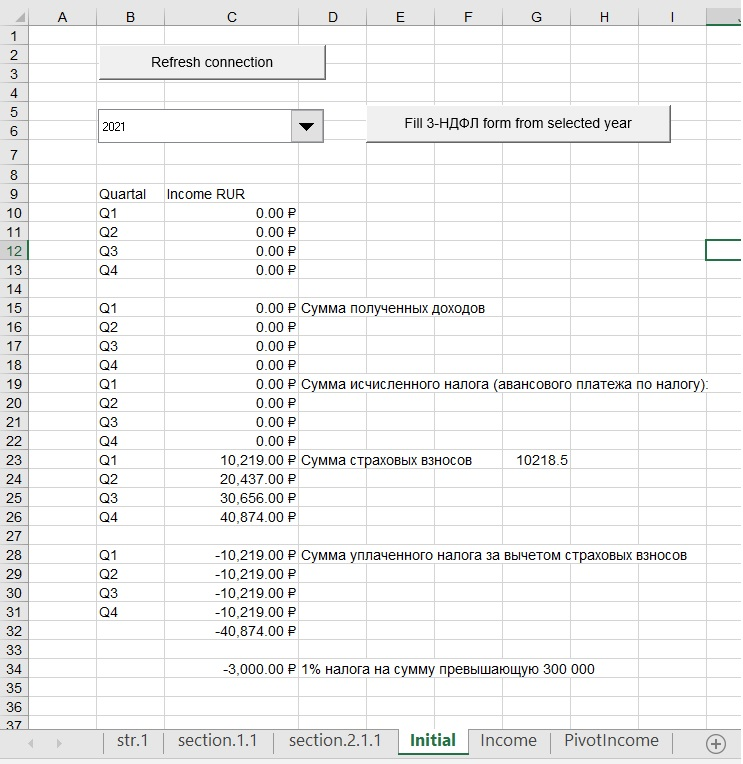
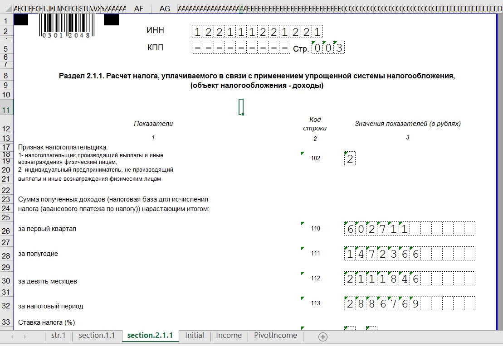

# Accounting for russian Individual Entrepreneur with an income in USD
An Example of data warehouse on MS-SQL Server 2019 and an example of getting USD currency rates from the  http://cbr.ru/ REST-API service

1) Install MS-SQL Server 2019
2) Install Microsoft Access Database Engine 2010 Redistributable. https://www.microsoft.com/en-us/download/confirmation.aspx?id=13255
```
./AccessDatabaseEngine_X64.exe /passive
```
3) Install database and upload sample data from IncomeBook.xlsx
```
 ./db.ps1
```
4) Open Declaration.xlsm, enable vba.
5) Click refresh connection button

<p align="center">
  
</p>
6) Select year and click button Fill 3-НДФЛ
<p align="center">
  
</p>


